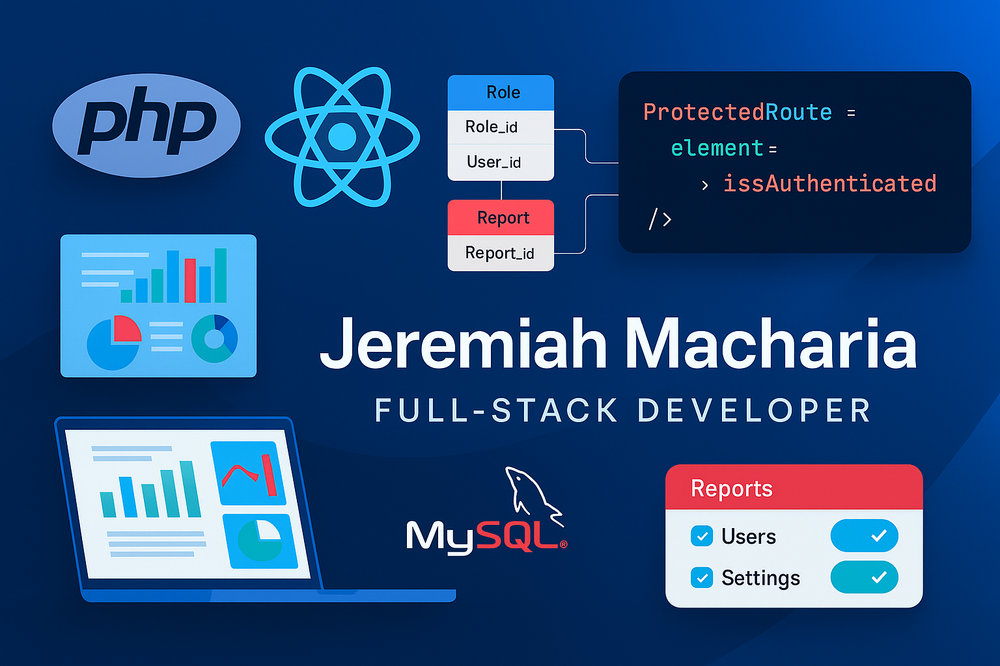

<!-- Banner -->

  

<h1 align="center">👋 Hi, I’m Jeremy Macharia</h1>
<h3 align="center">Financial Engineer ➔ Data & Business Analyst ➔ Full-Stack Developer</h3>

---

  <a href="#about-me"><strong>About Me</strong></a> •
  <a href="#education"><strong>Education</strong></a> •
  <a href="#experience"><strong>Experience</strong></a> •
  <a href="#technical-skills"><strong>Technical Skills</strong></a> •
  <a href="#projects"><strong>Projects</strong></a> •
  <a href="#contact"><strong>Contact</strong></a>

---

## 💡 About Me
I combine a **Financial Engineering** background with hands-on data analysis and full-stack development to build robust, data-driven solutions. Whether it’s back-end algorithms in Python/Django or rich front-end dashboards in React, I deliver scalable systems for fintech, SACCOs, insurance and business intelligence.

- 🔭 Currently exploring **Go**, **Rust**, **Kotlin** and **containerized CI/CD**  
- 🌱 Deepening expertise in **ML pipelines**, **serverless functions** and **real-time data streaming**  
- 👯 Open to collaborating on fintech platforms, data analytics tools and enterprise web apps  
- 🤔 Ask me about PHP session hardening, Django REST APIs, or advanced MySQL optimizations!

---

## 🎓 Education
- **B.Sc. Financial Engineering** | Jomo Kenyatta University of Agriculture & Technology, Kenya  
  _Second Class Honours (Upper Division)_

---

## 💼 Professional Experience

### 📊 Data Analyst  
**Murang’a County Government** • Inua Mkulima Program Launch (2024)  
- Cleaned, modeled & visualized agricultural finance data using **Python**, **Pandas**, **SQL**  
- Developed interactive **Tableau** dashboards to track farmer onboarding & subsidy disbursements  
- Automated weekly reports with **Airflow** and **PostgreSQL**  

### 🤝 Business Analyst (Volunteer)  
**Amica SACCO** • Business Development Department (2024)  
- Mapped member journeys & requirements, drafted user stories and wireframes  
- Conducted gap analysis and presented process-improvement proposals to stakeholders  

### 💻 Freelance Data Analyst & Developer  
**Independent Consultant** • 2022–Present  
- Built custom **ETL pipelines**, financial models and BI dashboards for SMEs  
- Designed and deployed **React** front-ends with **Node.js** back-ends on Lightsail  
- Delivered **PHP/MySQL** CRM and inventory solutions with role-based access control  

---

## 🛠️ Technical Skills

### 🔤 Languages  

  
  
  
  
  
  
  
  
  
  
  
  

### 🏗 Frameworks & Libraries  

  
  
  
  
  
  
  

### 📊 Data & BI Tools  

  
  
  
  

### ⚙️ DevOps & Tools  

  
  
  
  
  
  

---

## 📂 Projects
> Browse my pinned repos for live demos and code examples.

- **📈 Financial Dashboard** — Real-time KPI tracking with **Django**, **PostgreSQL** & **Chart.js**  
- **💳 POS & Inventory** — PHP/MySQL cashier system with dynamic Excel import & reporting  
- **🔐 Secure Auth Module** — Multi-factor login, role-based routing & audit logs (Express.js)  
- **🔄 Data Pipeline** — Python ETL with **Airflow**, **PostgreSQL** & automated email reporting  

---

## 📫 Contact  

  
  
  

---

## ⚡ Fun Fact  
> I recovered **120+ real business projects** after a full bootloader failure — and now my dev environment auto-backs up daily! 😎

  

